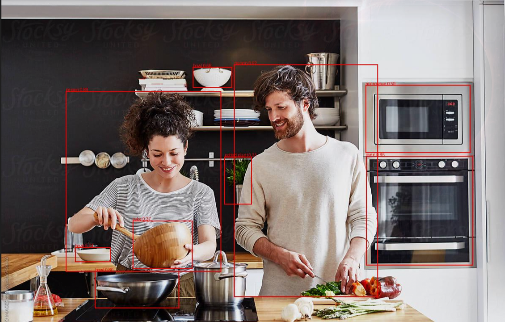

# Remote Inference API

## Installation

1. Clone the repository:
```bash
git clone <repository-url>
cd <repository-directory>
```

2. Create and activate a virtual environment:
```bash
python -m venv venv

# On Linux/MacOS:
source venv/bin/activate
# On Windows:
.\venv\Scripts\activate
```

3. Install the required dependencies:
```bash
pip install -r requirements.txt
```

## Usage

1. Start the Flask server:
```bash
python app.py
```

The server will start on port 5000 by default, or you can specify a different port using the `PORT` environment variable.

### API Endpoints

#### Health Check
- **GET** `/health`
- Returns the health status of the API

#### Load Model
- **POST** `/load_model`
- Request body:
```json
{
    "model_name": "yolov8n.pt"
}
```
- Loads a YOLO model for object detection

#### Detect Objects
- **POST** `/detect`
- Accepts an image file in the request
- Returns an annotated image with detected objects
- Form data key: `image`

## Example Usage

1. Load a model:
```bash
curl -X POST http://localhost:5000/load_model \
     -H "Content-Type: application/json" \
     -d '{"model_name": "yolov8n.pt"}'
```

2. Detect objects in an image:
```bash
curl -X POST http://localhost:5000/detect \
     -F "image=@path/to/your/image.jpg"
```

## Response Format

The `/detect` endpoint returns an annotated JPEG image with bounding boxes and labels for detected objects.
